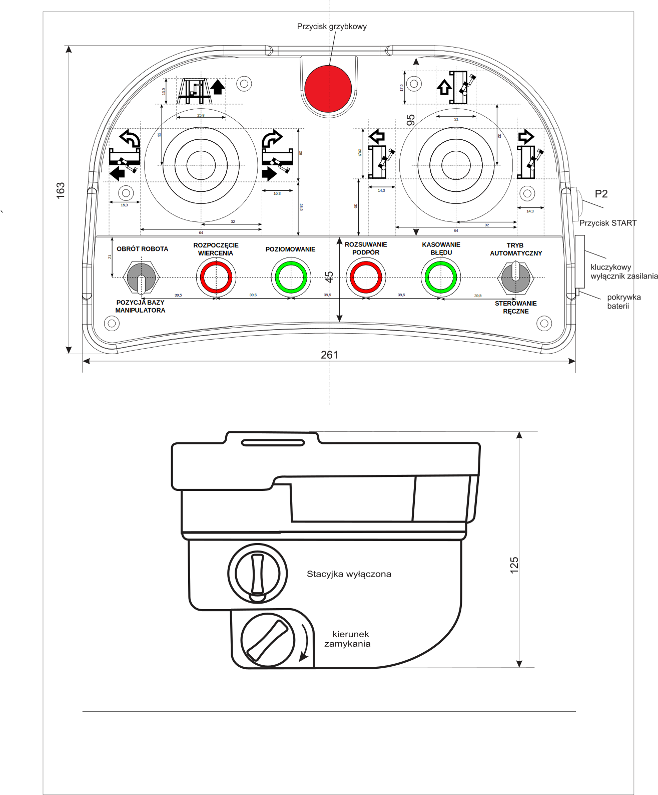
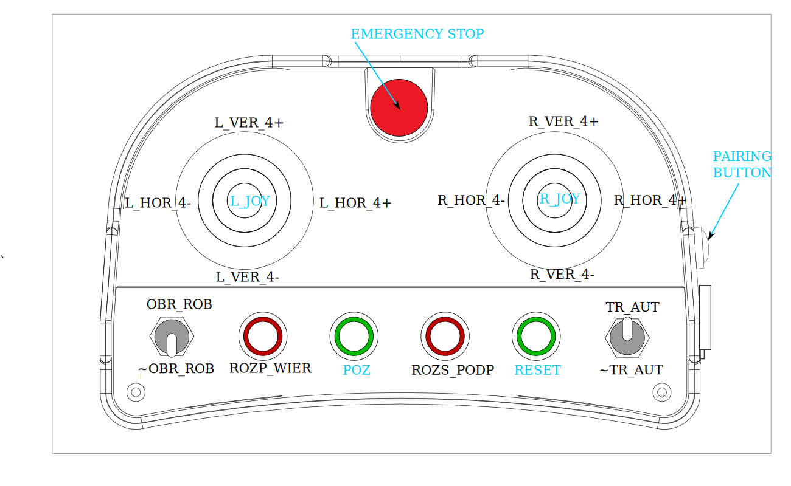
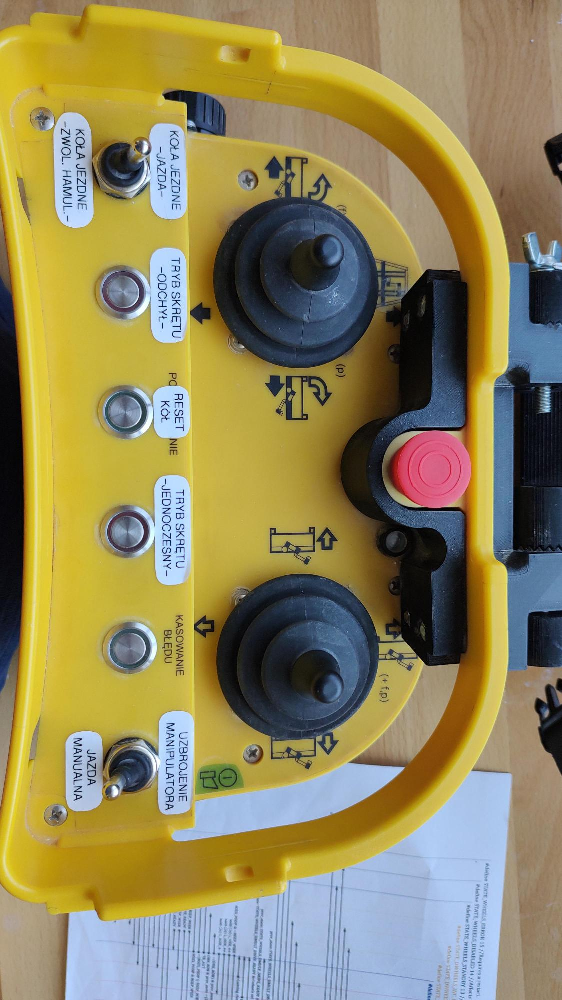
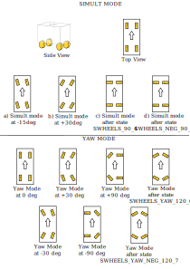
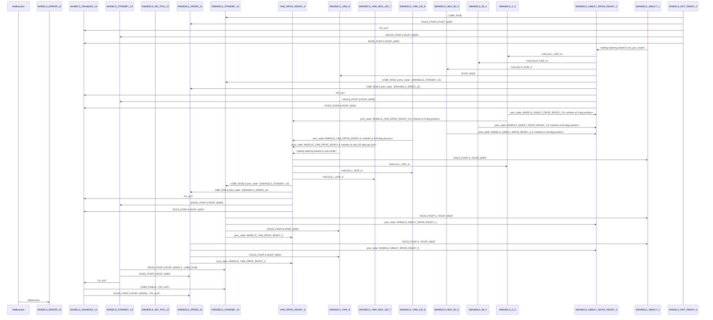

# Operating manual for plastering robot drivetrain
This is a project of steering algorithm dedicated for a prototype of plastering robot created at CBRTP,  where I was responsible for development, testing and documenting the operational capabilities of the drivetrain.

## Introduction
The robot has a total of 4 wheels, each is driven by two motors - one responsible for driving, the second one - for steering. 
The remote control device dedicated for steering is presented in the image below. 
It has two joysticks - their respective purposes are described in chapter () and the functionalities of the buttons in chapter ().

The red buttons are bistable, the green buttons - are monostable.

Because the robot was a prototype in development, many of the functionalities described on the remote control are not reflecting their final purpose. (like "ROZPOCZĘCIE WIERCENIA" is labeled on a state diagram as "ROZP_WIER", but on the remote it was renamed to "TRYB SKRĘTU -ODCHYŁ-")

The image below shows naming convention used for the buttons and the joys as they are used in the state machine logic and diagram. **Not every name is mentioned in the diagram  - they are displayed in blue text and are used as a reference** 

The current descriptions in polish used in remote control is on the photo below


### Turning on the robot
To turn on the robot, **all safety buttons have to be disengaged**, and the robot has to be connected to the 3-phase power socket. On top of that, there is a power switch next to the socket on the robot, which has to be turned into "1". After these steps, remote control can be connected to the robot
#### Light tower
The proper connection of remote control is indicated by a **light tower** placed on the robot - when **green light is turned on**, it is connected successfully, and the platform can be operated.
Malfunction, emergency stop, or connection issue from the tablet or remote control is indicated by a **red light on the light tower**.
#### Connecting the remote control
To pair up and connect the remote control, a key has to be inserted into the remote control and turned clockwise - this powers up the remote control. The key socket is placed next to the PAIRING BUTTON. After that, the PAIRING BUTTON has to be pressed and holded for 3 seconds - this should cause the light tower to light up the green light. If not, check battery condition and state of emergency switches - the emergency switch on the remote control has to be pulled upwards to be disengaged.


## Steering modes
There are two distinct driving modes:

1. **Yaw mode** - "TRYB SKRĘTU -ODCHYŁ-" - (ROZP_WIER)
2. **Simultaneous mode** "TRYB SKRĘTU -JEDNOCZESNY-" - (ROZS_PODP)

The principle of operation for each of the modes is shown in the illustration below. Arrows on each of the wheels shows the direction of moving when the robot is commanded to drive forward.


The **Yaw mode** enables robot to adjust the facing angle relative to the target wall.
The **Simultaneous mode** - enables the robot to move in translational direction by changing the distance to the target wall.


## Releasing the brakes for safety purposes
At any point during operation, the wheels can be transitioned into **standby mode**, where the wheel brakes are released, and the platform can be moved by hand for safety purposes. To do that, the rocker switch on the left has to be turned to down position, towards "KOŁA JEZDNE -ZWOL. HAMUL.-" position (~OBR_ROB). If the driving mode wasn't chosen, the wheels are in standby mode.


To ensure legibility and maximal simplicity for a coder - the sequence diagram is represented in mermaid.js code as follows:

## State machine sequence diagram

Raw text of state diagram:
```
participant M as Malfunction
participant 15 as WHEELS_ERROR_15
participant 14 as WHEELS_DISABLED_14
participant 13 as WHEELS_STANDBY_13
participant 12 as DWHEELS_INC_POS_12
participant 11 as DWHEELS_SPEED_11
participant 10 as DWHEELS_STANDBY_10
participant 9 as YAW_DRIVE_READY_9
participant 8 as SWHEELS_YAW_8
participant 7 as SWHEELS_YAW_NEG_120_7
participant 6 as SWHEELS_YAW_120_6
participant 5 as SWHEELS_NEG_90_5
participant 4 as SWHEELS_90_4
participant 3 as SWHEELS_0_3
participant 2 as SWHEELS_SIMULT_DRIVE_READY_2
participant 1 as SWHEELS_SIMULT_1
participant 0 as WHEELS_NOT_READY_0
0->>10: ~(OBR_ROB)
0->>11: ROZS_PODP || ROZP_WIER
0->>14: TR_AUT
0->>13: ~(ROZS_PODP || ROZP_WIER)
0->>14: ROZS_PODP & ROZP_WIER
1->>2: <setting steering wheels to inc_pos_mode>
2->>3: hold (1s) L_VER_4+
2->>4: hold (2s) R_HOR_4+
2->>5: hold (2s) R_HOR_4-
2->>8: ROZP_WIER
2->>10: ~(OBR_ROB) & prev_state ~(DWHEELS_STANDBY_10)
2->>11: OBR_ROB & prev_state ~(DWHEELS_SPEED_11)
2->>14: TR_AUT
2->>13: ~(ROZS_PODP || ROZP_WIER)
2->>14: ROZS_PODP & ROZP_WIER
3->>2: prev_state: WHEELS_SIMULT_DRIVE_READY_2 & <wheels at 0 deg position>
3->>9: prev_state: WHEELS_YAW_DRIVE_READY_9 & <wheels at 0 deg position>
4->>2: prev_state: WHEELS_SIMULT_DRIVE_READY_2 & <wheels at 90 deg position>
5->>2: prev_state: WHEELS_SIMULT_DRIVE_READY_2 & <wheels at -90 deg position>
6->>9: prev_state: WHEELS_YAW_DRIVE_READY & <wheels at 120 deg yaw pos>
7->>9: prev_state: WHEELS_YAW_DRIVE_READY & <wheels at neg 120 deg yaw pos>
8->>9: <setting steering wheels to yaw mode>
9->>1: ROZS_PODP & ~ROZP_WIER
9->>3: hold (1s) L_VER_4+
9->>6: hold (2s) L_HOR_4+
9->>7: hold (2s) L_HOR_4-
9->>10: ~(OBR_ROB) & prev_state ~(DWHEELS_STANDBY_10)
9->>11: OBR_ROB & prev_state ~(DWHEELS_SPEED_11)
9->>14: TR_AUT
9->>13: ~(ROZS_PODP || ROZP_WIER)
9->>14: ROZS_PODP & ROZP_WIER
10->>1: ROZS_PODP & ~ROZP_WIER
10->>2: prev_state: WHEELS_SIMULT_DRIVE_READY_2
10->>8: ~ROZS_PODP & ROZP_WIER
10->>9: prev_state: WHEELS_YAW_DRIVE_READY_9
11->>1: ROZS_PODP & ~ROZP_WIER
11->>2: prev_state: WHEELS_SIMULT_DRIVE_READY_2
11->>8: ~ROZS_PODP & ROZP_WIER
11->>9: prev_state: WHEELS_YAW_DRIVE_READY_9
13->>10: (ROZS_PODP || ROZP_WIER) & ~(OBR_ROB)
13->>11: ROZS_PODP || ROZP_WIER
13->>14: TR_AUT
14->>10: ~(OBR_ROB) & ~(TR_AUT)
14->>11: (ROZS_PODP || ROZP_WIER)& ~(TR_AUT)
M->>15: Malfunction
```

### Operation Logic
#### Transitional and operational states
The state machine described above uses memory of the previous state as well as gestures from joysticks to perform certain operations and change the state responsible for operation. Some states **transitional** - to perform operations safely (like straightening the wheels), while some are **operational**, like being in **yaw mode**, from which user input is expected. 

#### Role of transitional states
When wheels are during a certain operation specified by **transitional state**, the inputs from remote are ignored for safety reasons. The only exception is emergency stop button, which operates independently of the state machine logic. **Transitional states** were introduced to put wheels in certain positions to save time during adjustment of position relative to the target wall.

#### Examples of states 
Here are examples of transitional states:

SWHEELS_YAW_NEG_120_7 - When in **Yaw mode**, this state turns the wheels to their maximum turning position to change the angle relative to the wall without translational motion (around the middle of the platform). This states automatically returns to "YAW_DRIVE_READY_9" state after completion.

SWHEELS_NEG_90_5 - When in **Simultaneous mode**, this states turns the wheels to 90 degrees position to change the distance from the target wall. This state automatically returns to "SWHEELS_SIMULT_DRIVE_READY_2" state after completion.

SWHEELS_0_3 - This transitional state can be used on **Yaw mode** and **Simultaneous mode**  - to reset the wheels to their base (0 degrees) position quickly. After performing it's operation, this state transitions back to the previous state from which it was commanded. 


