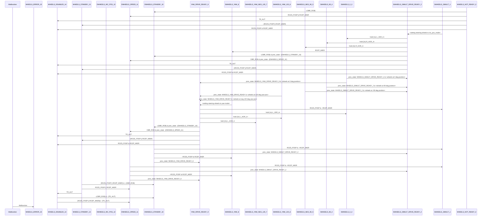
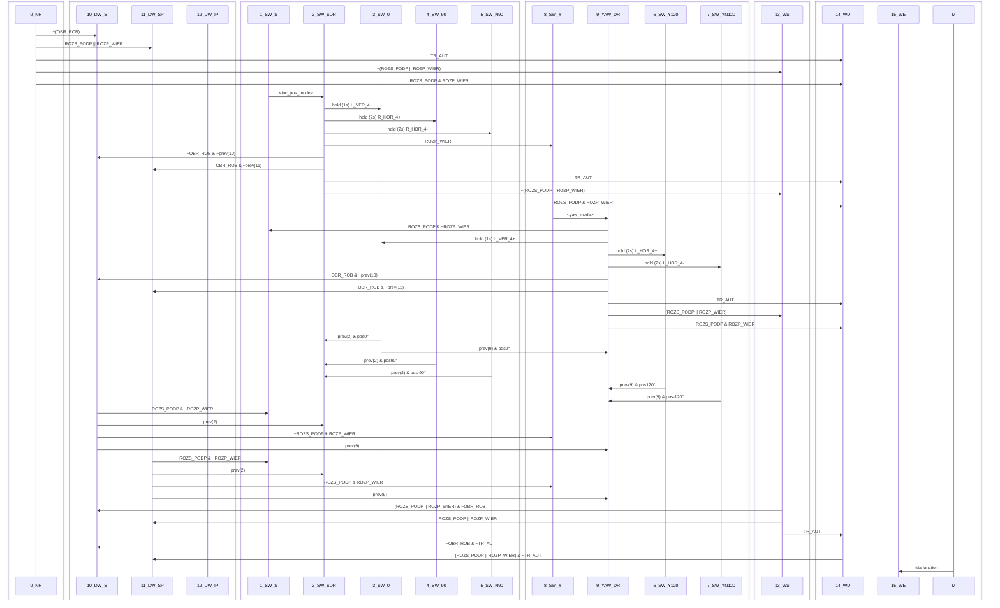

To ensure legibility and maximal simplicity for a coder - the sequence diagram is represented in mermaid.js code as follows:

```mermaid
sequenceDiagram
participant M as Malfunction
participant 15 as WHEELS_ERROR_15
participant 14 as WHEELS_DISABLED_14
participant 13 as WHEELS_STANDBY_13
participant 12 as DWHEELS_INC_POS_12
participant 11 as DWHEELS_SPEED_11
participant 10 as DWHEELS_STANDBY_10
participant 9 as YAW_DRIVE_READY_9
participant 8 as SWHEELS_YAW_8
participant 7 as SWHEELS_YAW_NEG_120_7
participant 6 as SWHEELS_YAW_120_6
participant 5 as SWHEELS_NEG_90_5
participant 4 as SWHEELS_90_4
participant 3 as SWHEELS_0_3
participant 2 as SWHEELS_SIMULT_DRIVE_READY_2
participant 1 as SWHEELS_SIMULT_1
participant 0 as WHEELS_NOT_READY_0
0->>10: ~(OBR_ROB)
0->>11: ROZS_PODP || ROZP_WIER
0->>14: TR_AUT
0->>13: ~(ROZS_PODP || ROZP_WIER)
0->>14: ROZS_PODP & ROZP_WIER
1->>2: <setting steering wheels to inc_pos_mode>
2->>3: hold (1s) L_VER_4+
2->>4: hold (2s) R_HOR_4+
2->>5: hold (2s) R_HOR_4-
2->>8: ROZP_WIER
2->>10: ~(OBR_ROB) & prev_state ~(DWHEELS_STANDBY_10)
2->>11: OBR_ROB & prev_state ~(DWHEELS_SPEED_11)
2->>14: TR_AUT
2->>13: ~(ROZS_PODP || ROZP_WIER)
2->>14: ROZS_PODP & ROZP_WIER
3->>2: prev_state: WHEELS_SIMULT_DRIVE_READY_2 & <wheels at 0 deg position>
3->>9: prev_state: WHEELS_YAW_DRIVE_READY_9 & <wheels at 0 deg position>
4->>2: prev_state: WHEELS_SIMULT_DRIVE_READY_2 & <wheels at 90 deg position>
5->>2: prev_state: WHEELS_SIMULT_DRIVE_READY_2 & <wheels at -90 deg position>
6->>9: prev_state: WHEELS_YAW_DRIVE_READY & <wheels at 120 deg yaw pos>
7->>9: prev_state: WHEELS_YAW_DRIVE_READY & <wheels at neg 120 deg yaw pos>
8->>9: <setting steering wheels to yaw mode>
9->>1: ROZS_PODP & ~ROZP_WIER
9->>3: hold (1s) L_VER_4+
9->>6: hold (2s) L_HOR_4+
9->>7: hold (2s) L_HOR_4-
9->>10: ~(OBR_ROB) & prev_state ~(DWHEELS_STANDBY_10)
9->>11: OBR_ROB & prev_state ~(DWHEELS_SPEED_11)
9->>14: TR_AUT
9->>13: ~(ROZS_PODP || ROZP_WIER)
9->>14: ROZS_PODP & ROZP_WIER
10->>1: ROZS_PODP & ~ROZP_WIER
10->>2: prev_state: WHEELS_SIMULT_DRIVE_READY_2
10->>8: ~ROZS_PODP & ROZP_WIER
10->>9: prev_state: WHEELS_YAW_DRIVE_READY_9
11->>1: ROZS_PODP & ~ROZP_WIER
11->>2: prev_state: WHEELS_SIMULT_DRIVE_READY_2
11->>8: ~ROZS_PODP & ROZP_WIER
11->>9: prev_state: WHEELS_YAW_DRIVE_READY_9
13->>10: (ROZS_PODP || ROZP_WIER) & ~(OBR_ROB)
13->>11: ROZS_PODP || ROZP_WIER
13->>14: TR_AUT
14->>10: ~(OBR_ROB) & ~(TR_AUT)
14->>11: (ROZS_PODP || ROZP_WIER)& ~(TR_AUT)
M->>15: Malfunction
```

Subdivision with respect to responsibilities of the states:

```mermaid
sequenceDiagram
    box #0d47a1 [A] Inicjalizacja
    participant 0 as 0_NR
    end
    
    box #4a148c [B] Napęd
    participant 10 as 10_DW_S
    participant 11 as 11_DW_SP
    participant 12 as 12_DW_IP
    end
    
    box #1b5e20 [C1] Jednoczesny Ster
    participant 1 as 1_SW_S
    participant 2 as 2_SW_SDR
    participant 3 as 3_SW_0
    participant 4 as 4_SW_90
    participant 5 as 5_SW_N90
    end
    
    box #33691e [C2] Yaw Ster
    participant 8 as 8_SW_Y
    participant 9 as 9_YAW_DR
    participant 6 as 6_SW_Y120
    participant 7 as 7_SW_YN120
    end
    
    box #2e7d32 [C3] Ster Ogólne
    participant 13 as 13_WS
    end
    
    box #b71c1c [D] Bezpieczeństwo
    participant 14 as 14_WD
    participant 15 as 15_WE
    participant M as M
    end
    
    %% Przejścia inicjalizacyjne
    0->>10: ~(OBR_ROB)
    0->>11: ROZS_PODP || ROZP_WIER
    0->>14: TR_AUT
    0->>13: ~(ROZS_PODP || ROZP_WIER)
    0->>14: ROZS_PODP & ROZP_WIER
    
    %% Tryb jednoczesny
    1->>2: <inc_pos_mode>
    2->>3: hold (1s) L_VER_4+
    2->>4: hold (2s) R_HOR_4+
    2->>5: hold (2s) R_HOR_4-
    2->>8: ROZP_WIER
    2->>10: ~OBR_ROB & ~prev(10)
    2->>11: OBR_ROB & ~prev(11)
    2->>14: TR_AUT
    2->>13: ~(ROZS_PODP || ROZP_WIER)
    2->>14: ROZS_PODP & ROZP_WIER
    
    %% Tryb Yaw
    8->>9: <yaw_mode>
    9->>1: ROZS_PODP & ~ROZP_WIER
    9->>3: hold (1s) L_VER_4+
    9->>6: hold (2s) L_HOR_4+
    9->>7: hold (2s) L_HOR_4-
    9->>10: ~OBR_ROB & ~prev(10)
    9->>11: OBR_ROB & ~prev(11)
    9->>14: TR_AUT
    9->>13: ~(ROZS_PODP || ROZP_WIER)
    9->>14: ROZS_PODP & ROZP_WIER
    
    %% Pozycje powrotne
    3->>2: prev(2) & pos0°
    3->>9: prev(9) & pos0°
    4->>2: prev(2) & pos90°
    5->>2: prev(2) & pos-90°
    6->>9: prev(9) & pos120°
    7->>9: prev(9) & pos-120°
    
    %% Napęd ↔ Sterowanie
    10->>1: ROZS_PODP & ~ROZP_WIER
    10->>2: prev(2)
    10->>8: ~ROZS_PODP & ROZP_WIER
    10->>9: prev(9)
    
    11->>1: ROZS_PODP & ~ROZP_WIER
    11->>2: prev(2)
    11->>8: ~ROZS_PODP & ROZP_WIER
    11->>9: prev(9)
    
    %% Bezpieczeństwo
    13->>10: (ROZS_PODP || ROZP_WIER) & ~OBR_ROB
    13->>11: ROZS_PODP || ROZP_WIER
    13->>14: TR_AUT
    
    14->>10: ~OBR_ROB & ~TR_AUT
    14->>11: (ROZS_PODP || ROZP_WIER) & ~TR_AUT
    
    M->>15: Malfunction
```