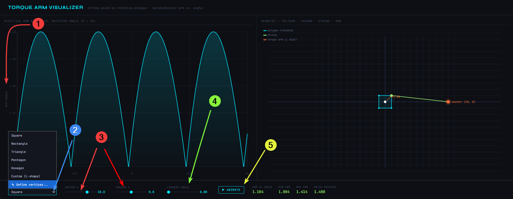
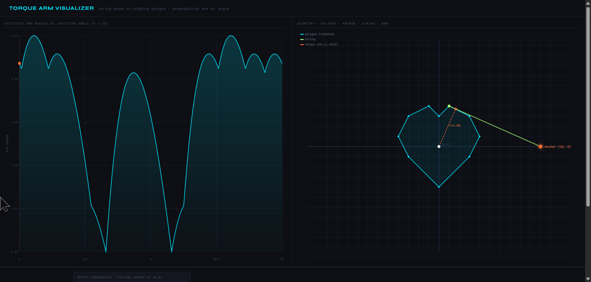

# Torque arm visualizer - user manual



## What does it do?
This program shows how the torque (effective arm) changes (1), when you rotate a 2D figure, to which a string is attached.
## Usage
To launch the program, simply download the "torque_arm.html" and open it in a browser. Then:
1. Choose a shape from the list (2)
2. Set an anchor point for the string using sliders (3)
3. Use the "current angle slider" (4) to see how the figure rotates and how position of the string changes.
4. Click on "Animate" (5) to see full rotation of the figure.
## Own shape
To set up own figure, Click on (2), and choose "Define vertices...".
From there, you can directly paste your own coordinates below in x,y format. For instance, the coordinates below form a heart shape:
```
0,3
1,4
3,3
4,1
3,-1
0,-4
-3,-1
-4,1
-3,3
-1,4
```
Then click "Parse & apply" - the figure will be visible on the right pane:

