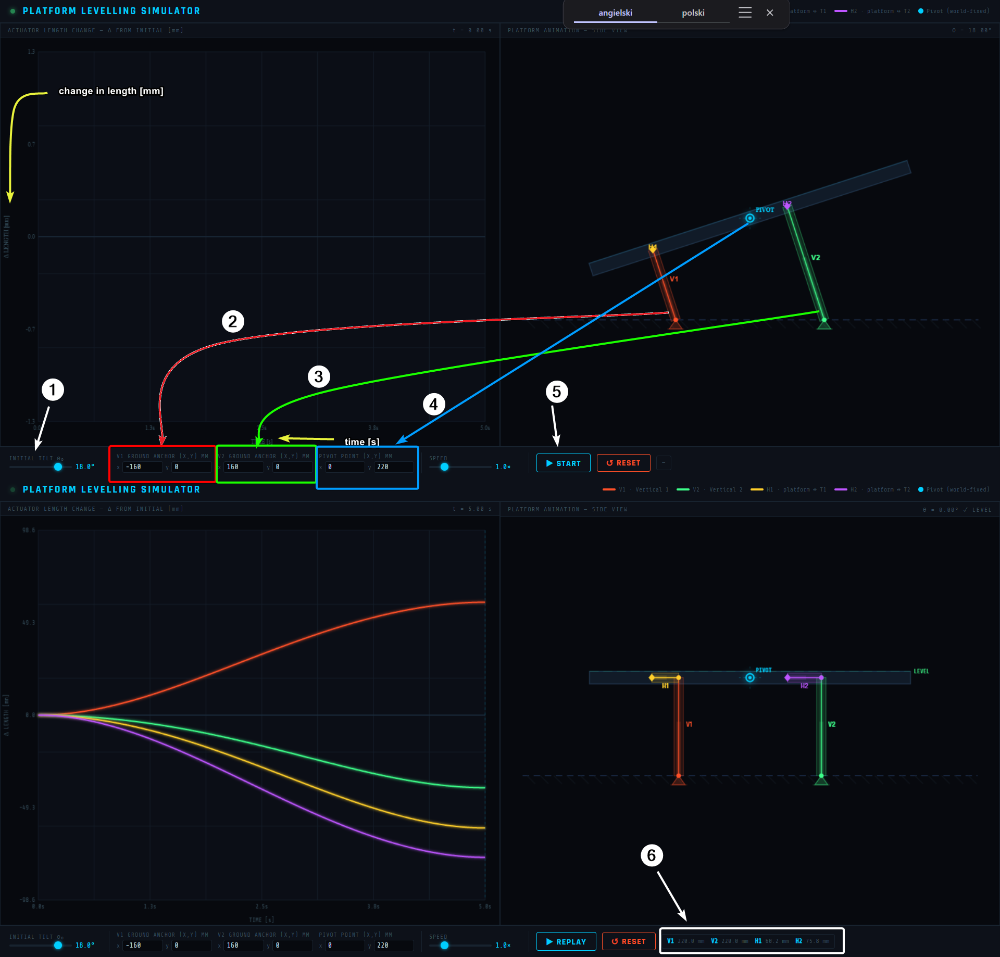
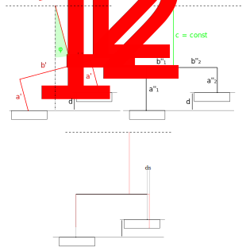

# Platform levelling simulator
This program uses 4 actuators to level a 2D platform to preserve defined axis of rotation (pivot) during levelling with supproting vertical actuators (V1, V2) staying at the same place on the ground. 
The upper position of the vertical actuators can be adjusted by horizontal actuators (H1, H2) attached to the levelled platform.

## Overview
The program can be launched in internet brwoser and operated directly by the user through UI. The image below shows the state of the example unlevelled platform, which is levelled while preserving the pivot point at the same plare with respect to global (ground) coordinates.

After levelling, the final displacements reached after levelling are visible at the bottom right part of the UI.

### Usage
(1) - First thing to change is the angle at which the platform is tilted. 
(2), (3) - coordinates of support point need to be defined for vertical actuators (V1 and V2).
(4) - Pivot point coordinates specify which point of the platform should remain in place with respect to the ground during the levelling phase.
(5) - After specifying all parameters, the simulation can be started. Change in length will appear at the left side on the graph for each actuator with respective colors, and the animation will show how each length changes.

## Principle of operation
When the distance between the supproting points of V1 and V2 is estabilished at the unlevelled surface, then during levelling phase, this span will create lateral load, and can lead to damage to the vertical actuators, which operate only in vertical direction. That's why during the levelling, the horizontal actuators H1 and H2 need to compensate change in this span to match the span at the ground when platform is levelled to ensure, that V1 and V2 won't slip, or worse - will bend outwards leading to damage. The cause of such phenomenon is visualized by the image below.

In the image, you can denote "ds" as a difference between the initial span do the vertical actuators before levelling, where it is longer (b'1 + b'2 > b"1 + b"2). 
Without the usage of horizontal actuators, this would directly translate to a torque load at the base of vertical actuators, which may cause damage.

### Application of the model
This model was used to maintain the relative position of the laser detector used for establishing distance of plastering robot from the target wall. By applying this model to the plastering robot, it was possible keep the laser detector in given position after levelling.

